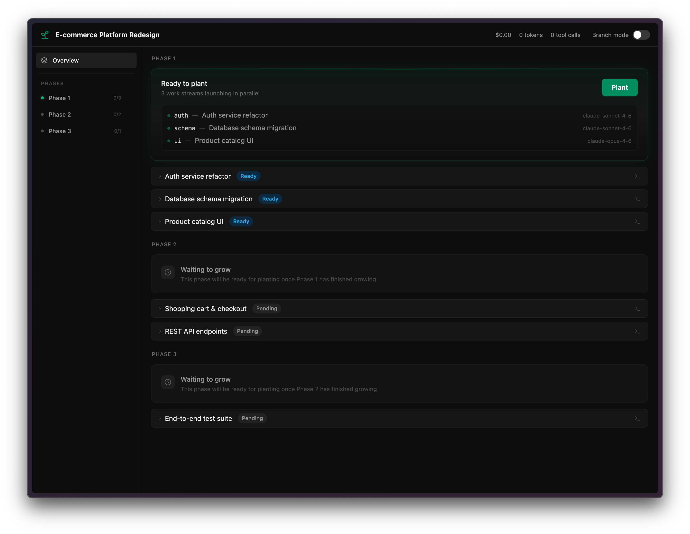

# Grove

Plan-aware agent orchestration for Pi. Grove reads a structured markdown plan, parses it into work streams with dependencies, and orchestrates parallel AI agents to execute them — all monitored through a real-time web dashboard.



## Quick Start

1. Install Grove as a Pi package:
   ```
   pi install pi-grove
   ```

2. Create a plan markdown file (see [Plan Format](#plan-format) below)

3. Initialize Grove:
   ```
   /grove init @docs/my-plan.md
   ```

4. Start the orchestration:
   ```
   /grove plant
   ```

5. Open the dashboard (auto-opens, or manually):
   ```
   /grove canopy
   ```

## Commands

### `/grove init [path]`
Parse a markdown plan and initialize the Grove workspace. If no path is given, you'll be prompted for one.

- Reads the markdown plan file
- Uses LLM to extract structured work streams, dependencies, and time slots
- Writes `plan.json` to `.pi/grove/`
- Resets any existing state

### `/grove plant`
Start the orchestration engine and spawn agents.

- Starts the HTTP + WebSocket dashboard server
- Creates the XState orchestrator for work stream lifecycle management
- Opens the dashboard in your browser
- Spawns agents for the first ready time slot
- Agents run in parallel up to the slot's `maxParallelAgents` limit

### `/grove canopy`
Open the dashboard without spawning agents. Useful for monitoring or reviewing state.

### `/grove status`
Display a text summary of all work streams and their current status in the terminal.

## How It Works

Grove breaks down a project plan into **work streams** organized in **time slots**:

1. **Plan Parsing**: Your markdown plan is parsed by an LLM into structured JSON with work streams, dependencies, phases, and time slots.

2. **Dependency Resolution**: Work streams with no unmet dependencies are marked "ready". As upstream work streams complete, downstream ones become ready automatically.

3. **Agent Orchestration**: When a time slot is planted, Grove spawns a Pi agent for each work stream. Each agent receives the work stream's brief, file list, and completion criteria.

4. **Real-time Monitoring**: The web dashboard shows live progress — tool calls, token usage, cost estimates, file modifications, and step completion.

5. **Steering**: You can send messages to running agents to adjust their approach, re-run failed agents, or manually mark work streams as done.

### Work Stream Lifecycle

```
pending -> ready -> running -> agent_complete -> done
                      |                           ^
                needs_attention -> (rerun) -------+
                                -> (human override) -+
```

## Plan Format

Grove expects a markdown file with this structure:

```markdown
# Plan Name

## Overview
Brief description of the project.

## Phase 1 — Phase Name
### Work Stream 1A: Stream Name
Description of what this stream does.

**Depends on:** (none)
**Files to create:**
- path/to/file1.ts
- path/to/file2.ts

**Done when:** Criteria for completion.

## Phase 2 — Phase Name
### Work Stream 2A: Stream Name
Description.

**Depends on:** Work Stream 1A
**Files to create:**
- path/to/file3.ts

**Done when:** Criteria for completion.

## Time Slots
| Slot | Work Streams | Max Parallel |
|------|-------------|-------------|
| 1    | 1A          | 1           |
| 2    | 2A, 2B      | 2           |
```

### Key Concepts

- **Work Stream**: A unit of work with an ID (e.g., "2A"), description, file list, and completion criteria
- **Phase**: A logical grouping of work streams (Phase 1, Phase 2, etc.)
- **Time Slot**: A scheduling unit that defines which work streams run in parallel and the max agent count
- **Dependencies**: Work streams can depend on other work streams — they won't start until dependencies are complete

## Dashboard

The Grove dashboard is a real-time web UI that shows:

- **Sidebar**: All work streams organized by time slot, with status indicators
- **Card Grid**: Agent cards showing live metrics (tool calls, tokens, cost, elapsed time)
- **Step Timeline**: Progress through the files each agent needs to create
- **Terminal View**: Raw tool call events from each agent
- **Steering Input**: Send messages to running agents to adjust their approach
- **Plant Prompt**: One-click to spawn agents for the next ready time slot

## Configuration

Grove stores its runtime data in `.pi/grove/`:
- `plan.json` — The parsed plan
- `state.json` — Current orchestrator state (persisted across restarts)
- `server.json` — Dashboard server info (port, PID)

The dashboard server runs on ports 4700-4799 by default.

## Development

```bash
# Install dependencies
bun install

# Run tests
bun run test

# Type check
bun run typecheck

# Build everything
bun run build
```

## License

MIT
