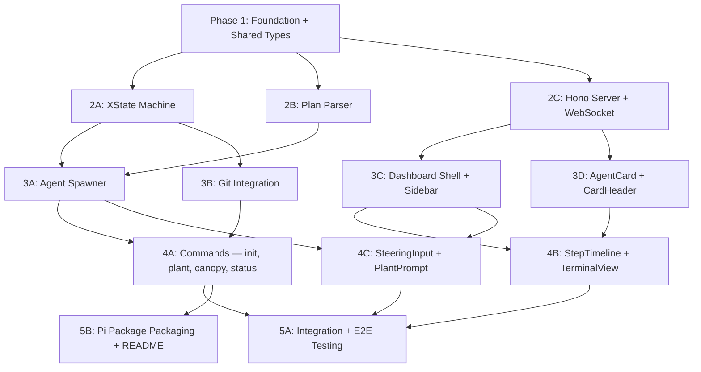

# Grove Build Plan — Phased Agent Execution

**Status:** Draft
**Date:** 2026-03-28
**Companion to:** `grove-spec-v2.md` (the authoritative design reference)

---

## Context

Grove is a greenfield Pi package providing plan-aware agent orchestration with a polished web dashboard. This plan decomposes the Grove spec into **5 phases with 14 parallelizable work streams**. Each work stream is scoped to be completable in a single focused agent session.

The plan follows Grove's own conventions: phases have dependencies, work streams within a phase can run in parallel, and each has explicit "done when" criteria.

### Conventions

**Package manager:** Use `bun` throughout — `bun install`, `bun run`, `bunx` instead of `npm`, `npm run`, `npx`. All `package.json` scripts, CI commands, and "done when" criteria use bun tooling.

**UI work streams:** All dashboard/frontend work streams (3C, 3D, 4B, 4C) must use the `/interface-design` skill before writing any component code. This skill enforces craft-driven design — domain exploration, signature elements, intentional token architecture, and anti-default checks. The agent must complete the skill's domain exploration and produce a direction before generating any UI code. On first UI work stream (3C), the agent should save the established design system to `.interface-design/system.md` so subsequent UI work streams (3D, 4B, 4C) maintain consistency.

---

## Dependency Graph



## Parallelism Schedule

| Slot | Agents | Work Streams | Est. Complexity |
|------|--------|-------------|-----------------|
| T1 | 1 | **1:** Foundation + Shared Types | Medium |
| T2 | 3 | **2A:** XState Machine, **2B:** Plan Parser, **2C:** Hono Server + WebSocket | Medium each |
| T3 | 4 | **3A:** Agent Spawner, **3B:** Git Integration, **3C:** Dashboard Shell + Sidebar, **3D:** AgentCard + CardHeader | Medium-High |
| T4 | 3 | **4A:** Commands, **4B:** StepTimeline + TerminalView, **4C:** SteeringInput + PlantPrompt | Medium |
| T5 | 2 | **5A:** Integration + E2E, **5B:** Packaging + README | High / Low |

**Peak parallelism: 4 agents.** Total work streams: 14.

---

## Phase 1: Foundation + Shared Types

**Dependencies:** None
**Agents:** 1
**Est. Duration:** Single session

### Work Stream 1 — Project Scaffolding + Shared Types

**Scope:** Initialize the monorepo-style Pi package with both the extension and dashboard sub-projects, all dependencies, build tooling, and the shared type system that every downstream work stream depends on.

**Files to create:**
```
package.json                          # Root package with workspaces
tsconfig.json                         # Root TypeScript config
tsconfig.base.json                    # Shared compiler options
.gitignore
.eslintrc.json
README.md                            # Placeholder

extension/
  package.json                        # Extension package
  tsconfig.json
  index.ts                            # Pi extension entry point (empty handlers)
  lib/
    types.ts                          # All shared TypeScript interfaces
    constants.ts                      # Status labels, icons, event names

dashboard/
  package.json                        # Dashboard package
  tsconfig.json
  vite.config.ts                      # Vite config
  tailwind.config.ts                  # Tailwind config
  index.html                          # SPA entry point
  src/
    App.tsx                           # Empty shell
    main.tsx                          # React entry
    lib/
      types.ts                        # Re-exports/mirrors extension types
      constants.ts                    # Status icons, colors, labels
```

**Dependencies to install:**

Extension (`extension/package.json`):
```json
{
  "dependencies": {
    "@mariozechner/pi-coding-agent": "latest",
    "@mariozechner/pi-agent-core": "latest",
    "xstate": "^5",
    "hono": "latest",
    "@hono/node-ws": "latest",
    "open": "latest"
  },
  "devDependencies": {
    "typescript": "latest",
    "@types/node": "latest",
    "vitest": "latest"
  }
}
```

Dashboard (`dashboard/package.json`):
```json
{
  "dependencies": {
    "react": "latest",
    "react-dom": "latest"
  },
  "devDependencies": {
    "@types/react": "latest",
    "@types/react-dom": "latest",
    "typescript": "latest",
    "vite": "latest",
    "@vitejs/plugin-react": "latest",
    "tailwindcss": "latest",
    "autoprefixer": "latest",
    "postcss": "latest"
  }
}
```

Note: shadcn/ui components are added in Phase 3 when the dashboard components are built — they require `bunx shadcn-ui init` after the Vite + Tailwind foundation exists.

**Key types in `extension/lib/types.ts`:**
```typescript
// Plan schema
export interface GrovePlan {
  name: string;
  source: string;
  workStreams: Record<string, WorkStream>;
  timeSlots: TimeSlot[];
}

export interface WorkStream {
  id: string;
  name: string;
  phase: number;
  dependencies: string[];
  brief: string;
  filesToCreate: string[];
  doneWhen: string;
  model?: string;
  status: WorkStreamStatus;
}

export type WorkStreamStatus =
  | "pending"
  | "ready"
  | "running"
  | "agent_complete"
  | "verifying"
  | "done"
  | "needs_attention";

export interface TimeSlot {
  slot: number;
  workStreamIds: string[];
  maxParallelAgents: number;
}

// Runtime state
export interface AgentMetrics {
  workStreamId: string;
  toolCalls: number;
  tokensUsed: number;
  estimatedCost: number;
  elapsedMs: number;
  currentFile: string | null;
}

// Events (extension → dashboard via WebSocket)
export type GroveEvent =
  | { type: "state_change"; workStreamId: string; status: WorkStreamStatus }
  | { type: "agent_event"; workStreamId: string; event: AgentToolEvent }
  | { type: "metrics_update"; workStreamId: string; metrics: AgentMetrics }
  | { type: "plan_loaded"; plan: GrovePlan }
  | { type: "slot_ready"; slot: number }
  | { type: "error"; workStreamId?: string; message: string };

export interface AgentToolEvent {
  timestamp: number;
  toolName: string;        // "read", "write", "edit", "bash"
  input: string;           // file path or command
  output?: string;         // truncated result
  status: "started" | "completed" | "failed";
}

// Commands (dashboard → extension via WebSocket)
export type GroveCommand =
  | { type: "plant_slot"; slot: number }
  | { type: "steer_agent"; workStreamId: string; message: string }
  | { type: "rerun_agent"; workStreamId: string; message?: string }
  | { type: "mark_done"; workStreamId: string }
  | { type: "set_branch_mode"; enabled: boolean };

// Server config
export interface ServerConfig {
  port: number;
  pid: number;
  startedAt: string;
}
```

**Key constants in `extension/lib/constants.ts`:**
```typescript
export const GROVE_DIR = ".pi/grove";
export const PLAN_FILE = "plan.json";
export const STATE_FILE = "state.json";
export const SERVER_FILE = "server.json";
export const DEFAULT_PORT_RANGE = [4700, 4799] as const;
export const WS_PATH = "/ws";

export const STATUS_LABELS: Record<WorkStreamStatus, string> = {
  pending: "Pending",
  ready: "Ready",
  running: "Running",
  agent_complete: "Agent Complete",
  verifying: "Verifying",
  done: "Done",
  needs_attention: "Needs Attention",
};
```

**Pi SDK Validation (critical — do this first):**
Before scaffolding, validate the core assumption that Pi SDK embedded instances share `withFileMutationQueue`. Write a minimal test script that:
1. Imports `@mariozechner/pi-agent-core`
2. Creates two agent instances in the same process
3. Has both write to the same file concurrently
4. Confirms writes are serialized (no corruption)

If this fails, the architecture must fall back to separate Pi processes (Option C from the spec), which changes work streams 3A and the conflict resolution model. Document the result in `.pi/grove/sdk-validation.md`.

**Dashboard Path Resolution:**
The extension needs to locate `dashboard/dist/` at runtime to serve static files via Hono. Use `import.meta.url` relative resolution — the dashboard build output lives at a known path relative to the extension's install location within the Pi package. Store this as a constant in `extension/lib/constants.ts`:
```typescript
export const DASHBOARD_DIST_PATH = new URL("../../dashboard/dist", import.meta.url).pathname;
```

**Done when:**
- Pi SDK validation script confirms in-process file mutation queue works across agent instances (or documents fallback path)
- `bun install` succeeds at root
- `bunx tsc --noEmit` succeeds for both extension and dashboard
- `bun run build` succeeds for dashboard (empty Vite build)
- Extension `index.ts` exports a default function conforming to Pi's `ExtensionAPI` signature
- All types compile and are importable from both packages
- `DASHBOARD_DIST_PATH` resolves correctly at runtime

---

## Phase 2: Core Infrastructure

**Dependencies:** Phase 1
**Agents:** 3 (parallel)

### Work Stream 2A — XState v5 State Machine

**Scope:** The orchestrator state machine that manages work stream lifecycles and dependency resolution.

**Files to create:**
```
extension/orchestrator/
  machine.ts                          # XState v5 machine definition
  persistence.ts                      # Serialize/restore state to disk
  machine.test.ts                     # Unit tests
```

**Key logic:**

`machine.ts`:
```typescript
import { setup, assign, fromPromise } from "xstate";

// Per-work-stream machine
export const workStreamMachine = setup({
  types: {} as {
    context: {
      workStream: WorkStream;
      metrics: AgentMetrics;
    };
    events:
      | { type: "DEPENDENCIES_MET" }
      | { type: "PLANT" }
      | { type: "AGENT_COMPLETE" }
      | { type: "VERIFICATION_PASSED" }
      | { type: "VERIFICATION_FAILED"; reason: string }
      | { type: "HUMAN_OVERRIDE" }
      | { type: "RERUN"; message?: string }
      | { type: "STEER"; message: string }
      | { type: "METRICS_UPDATE"; metrics: Partial<AgentMetrics> };
  },
}).createMachine({
  id: "workStream",
  initial: "pending",
  context: ({ input }) => ({
    workStream: input.workStream,
    metrics: { workStreamId: input.workStream.id, toolCalls: 0, tokensUsed: 0, estimatedCost: 0, elapsedMs: 0, currentFile: null },
  }),
  states: {
    pending: { on: { DEPENDENCIES_MET: "ready" } },
    ready: { on: { PLANT: "running" } },
    running: {
      on: {
        AGENT_COMPLETE: "agent_complete",
        STEER: { /* forward to agent, stay in running */ },
        METRICS_UPDATE: { actions: assign(/* merge metrics */) },
      },
    },
    agent_complete: {
      always: "done", // MVP: pass-through. v1.1: transition to "verifying"
    },
    verifying: {
      on: {
        VERIFICATION_PASSED: "done",
        VERIFICATION_FAILED: "needs_attention",
      },
    },
    done: { type: "final" },
    needs_attention: {
      on: {
        HUMAN_OVERRIDE: "done",
        RERUN: "running",
      },
    },
  },
});

// Orchestrator: manages all work stream machines + dependency resolution
export function createOrchestrator(plan: GrovePlan): {
  // Returns an orchestrator that:
  // 1. Creates a machine instance per work stream
  // 2. Listens for "done" transitions and checks downstream dependencies
  // 3. Fires DEPENDENCIES_MET on work streams whose deps are all done
  // 4. Emits events for the WebSocket layer
};
```

`persistence.ts`:
```typescript
export function saveState(groveDir: string, snapshot: unknown): void;
  // Serialize XState snapshot to STATE_FILE
  // Write atomically (write to temp, rename)

export function loadState(groveDir: string): unknown | null;
  // Read STATE_FILE, return parsed snapshot or null if not found

export function resetState(groveDir: string): void;
  // Delete STATE_FILE
```

**Done when:**
- Work stream machine transitions correctly through all states: `pending → ready → running → agent_complete → done`
- `needs_attention → rerun → running` loop works
- `needs_attention → human_override → done` works
- Orchestrator correctly resolves dependencies: when all upstream work streams are `done`, downstream work streams receive `DEPENDENCIES_MET`
- State persists to disk and restores correctly after simulated restart
- All unit tests pass

---

### Work Stream 2B — Plan Parser

**Scope:** The module that reads a plan markdown file and extracts the structured `plan.json` representation. Uses the LLM (via Pi's current session) to parse.

**Files to create:**
```
extension/parser/
  plan.ts                             # Plan parsing logic
  prompt.ts                           # LLM prompt for plan extraction
  plan.test.ts                        # Unit tests with fixture plans
  fixtures/
    sample-plan.md                    # Test fixture (subset of Assessment-in-a-Box plan)
    expected-plan.json                # Expected parse output
```

**Key logic:**

`plan.ts`:
```typescript
export async function parsePlan(
  planMarkdown: string,
  llmCall: (prompt: string) => Promise<string>
): Promise<GrovePlan>;
  // 1. Construct a prompt that instructs the LLM to extract:
  //    - Project name
  //    - Work streams with IDs, names, phases, dependencies, briefs, filesToCreate, doneWhen
  //    - Time slots with parallelism schedule
  // 2. Call the LLM with the plan markdown + extraction prompt
  // 3. Parse the LLM's JSON response
  // 4. Validate against GrovePlan schema
  // 5. Set all work stream statuses to "pending"
  // 6. Return the validated plan

export function validatePlan(plan: unknown): plan is GrovePlan;
  // Runtime validation:
  // - All work stream IDs referenced in timeSlots exist in workStreams
  // - All dependency IDs reference valid work streams
  // - No circular dependencies
  // - At least one work stream with no dependencies (entry point)

export function writePlan(groveDir: string, plan: GrovePlan): void;
  // Write plan.json atomically

export function readPlan(groveDir: string): GrovePlan | null;
  // Read plan.json, return null if not found
```

`prompt.ts`:
```typescript
export function buildExtractionPrompt(planMarkdown: string): string;
  // Returns a prompt that:
  // 1. Instructs the LLM to extract the Grove plan structure
  // 2. Provides the GrovePlan JSON schema as a reference
  // 3. Includes the plan markdown as input
  // 4. Requests JSON-only output (no preamble, no backticks)
  // 5. Includes examples of expected output format
```

**Done when:**
- `parsePlan()` correctly extracts work streams, dependencies, time slots from the sample fixture
- Circular dependency detection works
- Invalid plans (missing IDs, broken references) are caught by validation
- `writePlan()` and `readPlan()` roundtrip correctly
- All unit tests pass

---

### Work Stream 2C — Hono Server + WebSocket

**Scope:** The HTTP + WebSocket server that serves the dashboard and provides real-time event streaming.

**Files to create:**
```
extension/server/
  index.ts                            # Hono app setup, static file serving
  routes.ts                           # REST API endpoints
  ws.ts                               # WebSocket connection management + event broadcasting
  port.ts                             # Port assignment + server.json management
  server.test.ts                      # Unit tests
```

**Key logic:**

`index.ts`:
```typescript
export async function startServer(
  groveDir: string,
  dashboardDistPath: string
): Promise<{ port: number; close: () => void }>;
  // 1. Find available port in DEFAULT_PORT_RANGE
  // 2. Create Hono app
  // 3. Mount REST routes from routes.ts
  // 4. Set up WebSocket upgrade handler from ws.ts
  // 5. Serve dashboard static files from dashboardDistPath
  // 6. Write server.json with port, PID, timestamp
  // 7. Return port and close function

export function isServerRunning(groveDir: string): { running: boolean; port?: number };
  // Read server.json, check if PID is still alive
```

`routes.ts`:
```typescript
// GET /api/plan — return current plan.json
// GET /api/state — return current state (all work stream statuses + metrics)
// POST /api/command — receive GroveCommand from dashboard, forward to orchestrator
```

`ws.ts`:
```typescript
export class GroveBroadcaster {
  // Manages WebSocket connections
  // broadcast(event: GroveEvent): void — send to all connected clients
  // handleConnection(ws: WebSocket): void — register new client, send initial state
  // handleMessage(ws: WebSocket, data: GroveCommand): void — parse and route commands
}
```

`port.ts`:
```typescript
export function findAvailablePort(range: readonly [number, number]): Promise<number>;
  // Try ports in range until one is available

export function writeServerConfig(groveDir: string, config: ServerConfig): void;
export function readServerConfig(groveDir: string): ServerConfig | null;
export function clearServerConfig(groveDir: string): void;
```

**Done when:**
- Server starts on an available port and serves static files
- REST endpoints return correct data (mock plan and state for testing)
- WebSocket connections establish and receive broadcast events
- WebSocket messages from clients are parsed as `GroveCommand` and routed
- Multiple simultaneous WebSocket clients all receive broadcasts
- `server.json` is written on start and cleared on close
- `isServerRunning()` correctly detects live vs stale server
- All unit tests pass

---

## Phase 3: Agent Spawning + Dashboard Components

**Dependencies:** Phase 2
**Agents:** 4 (parallel)

### Work Stream 3A — Agent Spawner (Pi SDK Integration)

**Scope:** The module that embeds Pi agent instances via the SDK, manages their lifecycle, captures events, and connects them to the orchestrator state machine.

**Dependencies:** 2A (XState machine), 2B (plan parser — for reading work stream briefs)

**Files to create:**
```
extension/orchestrator/
  spawner.ts                          # Pi SDK agent instance management
  agent-bridge.ts                     # Bridge between Pi agent events and Grove events
  spawner.test.ts                     # Unit tests (mocked Pi SDK)

extension/tools/
  mark-complete.ts                    # mark_complete tool definition
```

**Key logic:**

`spawner.ts`:
```typescript
import { Agent } from "@mariozechner/pi-agent-core";

export class AgentSpawner {
  constructor(
    private orchestrator: Orchestrator,
    private broadcaster: GroveBroadcaster,
    private projectRoot: string
  ) {}

  async spawnForWorkStream(workStream: WorkStream): Promise<void>;
    // 1. Create Pi agent instance via SDK
    // 2. Set model from workStream.model or default
    // 3. Build system prompt via buildAgentSystemPrompt()
    // 4. Register mark_complete tool
    // 5. Set up event listeners (tool_call, tool_result, error, compaction) via agent-bridge
    // 6. Send workStream.brief as the initial prompt
    // 7. Update orchestrator: transition work stream to "running"

  async steerAgent(workStreamId: string, message: string): Promise<void>;
    // Send steering message to running agent instance

  async stopAgent(workStreamId: string): Promise<void>;
    // Gracefully stop agent instance

  async stopAllAgents(): Promise<void>;
    // Stop all running agents (used during shutdown)

  async rerunAgent(workStreamId: string, message?: string): Promise<void>;
    // Stop existing instance (if any), spawn fresh with optional steering context

  getRunningAgents(): Map<string, AgentInstance>;
}

export function buildAgentSystemPrompt(workStream: WorkStream): string;
  // Returns a system prompt that tells the agent:
  // 1. It is working on a specific work stream within a larger plan
  // 2. Its scope (from workStream.brief)
  // 3. The files it is expected to create (from workStream.filesToCreate)
  // 4. The "done when" criteria it should aim for
  // 5. It must call mark_complete when finished, with a summary
  // 6. It should not modify files outside its scope unless necessary
  // 7. It has access to the full project filesystem
```

`agent-bridge.ts`:
```typescript
export function bridgeAgentEvents(
  agent: AgentInstance,
  workStreamId: string,
  broadcaster: GroveBroadcaster,
  orchestrator: Orchestrator
): void;
  // Subscribe to Pi agent events:
  // - tool_call → broadcast AgentToolEvent (started)
  // - tool_result → broadcast AgentToolEvent (completed/failed)
  // - error → broadcast error event, surface in dashboard card
  // - compaction → broadcast info event (context was compacted, agent continues)
  // - Track metrics: increment toolCalls, update currentFile, accumulate tokens
  // - On mark_complete tool call → send AGENT_COMPLETE to orchestrator
  // - Periodically broadcast metrics_update events
  //
  // Error handling:
  // - LLM API errors (rate limit, network) → retry with backoff, broadcast error event
  // - Agent crash → transition to needs_attention, broadcast error with details
  // - Context limit → allow Pi's compaction to handle, log warning
```

`mark-complete.ts`:
```typescript
export function createMarkCompleteTool(
  workStreamId: string,
  onComplete: () => void
): AgentTool;
  // Returns a Pi AgentTool:
  // - name: "mark_complete"
  // - description: "Call this when you have completed all tasks for this work stream"
  // - schema: { summary: string } — agent provides a brief summary of what was done
  // - execute: calls onComplete callback, returns confirmation message
```

**Done when:**
- Agent instances can be created via Pi SDK with custom model and tools
- `mark_complete` tool is callable by the agent and triggers orchestrator state transition
- Agent events (tool calls) are captured and broadcast as `GroveEvent`s
- Metrics (tool call count, token usage, cost, current file) are tracked per agent
- Steering messages are delivered to running agents
- Agents can be stopped and re-run
- All unit tests pass (with mocked Pi SDK)

---

### Work Stream 3B — Git Integration

**Scope:** Auto-commit on work stream completion and branch-per-slot mode.

**Dependencies:** 2A (XState machine — listens for `done` transitions)

**Files to create:**
```
extension/git/
  commits.ts                          # Auto-commit and branch management
  git.ts                              # Low-level git operations (shell out to git)
  commits.test.ts                     # Unit tests
```

**Key logic:**

`git.ts`:
```typescript
// Low-level git wrappers (all shell out via child_process)
export async function isGitRepo(cwd: string): Promise<boolean>;
export async function getCurrentBranch(cwd: string): Promise<string>;
export async function createBranch(cwd: string, name: string): Promise<void>;
export async function checkoutBranch(cwd: string, name: string): Promise<void>;
export async function stageAll(cwd: string): Promise<void>;
export async function commit(cwd: string, message: string): Promise<string>; // returns commit hash
export async function hasUncommittedChanges(cwd: string): Promise<boolean>;
```

`commits.ts`:
```typescript
export class GroveGitManager {
  constructor(private projectRoot: string) {}

  async onWorkStreamDone(workStream: WorkStream): Promise<string | null>;
    // 1. Check if project is a git repo (skip if not)
    // 2. Stage all changes
    // 3. Commit with message: "grove({id}): {name} — complete"
    // 4. Return commit hash or null if nothing to commit

  async prepareBranchForSlot(slot: number): Promise<void>;
    // 1. Create and checkout branch: grove/t{slot}
    // Used only when branch mode is enabled

  async getBranchMode(): boolean;
    // Read from grove config or default false

  async setBranchMode(enabled: boolean): void;
    // Persist branch mode preference
}
```

**Done when:**
- Auto-commit fires when a work stream transitions to `done`
- Commit message follows format `grove(2A): Shared Types + File Schemas — complete`
- Branch mode creates `grove/t{n}` branch before spawning slot agents
- Gracefully handles non-git projects (no-op)
- Gracefully handles no uncommitted changes (skip commit)
- All unit tests pass

---

### Work Stream 3C — Dashboard Shell + Sidebar

**Scope:** The dashboard layout shell (header, sidebar, main area) and the sidebar component with time-slot grouping.

**Dependencies:** 2C (Hono server — for WebSocket connection and REST API)

**Files to create:**
```
dashboard/src/
  App.tsx                             # Layout shell (header + sidebar + main area)
  components/
    DashboardHeader.tsx               # Logo, project name, aggregate cost, branch toggle
    Sidebar.tsx                       # Time-slot grouped work stream list
  hooks/
    useWebSocket.ts                   # WebSocket connection, event handling, command sending
    usePlanState.ts                   # Plan state management (from WS events + REST)
  lib/
    types.ts                          # Full type definitions (mirrored from extension)
    constants.ts                      # Status icons, colors, labels for UI
```

**Pre-requisite: interface-design skill.** Before writing any component code, the agent must invoke the `/interface-design` skill to explore Grove's product domain, establish a design direction, and define the token/component system. This is the first UI work stream — the agent should complete the full domain exploration flow (domain concepts, color world, signature element, defaults to reject) and save the resulting design system to `.interface-design/system.md` for consistency across all subsequent UI work streams (3D, 4B, 4C).

**Pre-requisite: shadcn/ui setup.** Run `bunx shadcn-ui@latest init` in the dashboard directory to set up shadcn/ui. Then add needed components: `bunx shadcn-ui@latest add button badge collapsible toggle scroll-area`.

**Key logic:**

`useWebSocket.ts`:
```typescript
export function useWebSocket(url: string): {
  connected: boolean;
  sendCommand: (cmd: GroveCommand) => void;
  lastEvent: GroveEvent | null;
};
  // 1. Establish WebSocket connection
  // 2. Auto-reconnect on disconnect
  // 3. Parse incoming messages as GroveEvent
  // 4. Provide sendCommand for outgoing GroveCommand
```

`usePlanState.ts`:
```typescript
export function usePlanState(ws: ReturnType<typeof useWebSocket>): {
  plan: GrovePlan | null;
  workStreams: Record<string, WorkStream & { metrics: AgentMetrics }>;
  timeSlots: TimeSlot[];
  aggregateMetrics: { totalCost: number; totalTokens: number };
};
  // 1. Fetch initial plan from GET /api/plan on mount
  // 2. Fetch initial state from GET /api/state on mount
  // 3. Apply incoming GroveEvents to update local state
  // 4. Compute aggregate metrics across all work streams
```

`Sidebar.tsx`:
- Collapsible sections per time slot (T1, T2, T3...)
- Work streams listed under each slot
- Status icon per work stream (○ ◉ ● ◐ ✓ ⚠)
- Dependency text per work stream
- Click time slot to scroll main area

`DashboardHeader.tsx`:
- Grove logo (🌳 + "Grove" text)
- Project name from plan
- Aggregate cost and token count
- Branch mode toggle (on/off)

**Done when:**
- Dashboard loads in browser and connects to WebSocket
- Sidebar renders all time slots and work streams from plan
- Status icons update in real-time as GroveEvents arrive
- DashboardHeader shows project name and aggregate metrics
- Branch mode toggle sends `set_branch_mode` command
- Layout is responsive and polished (dark theme, product-grade feel)
- shadcn/ui components are properly configured and styled

---

### Work Stream 3D — AgentCard + CardHeader

**Scope:** The core card component that represents a single agent/work stream in the main area.

**Dependencies:** 2C (Hono server — for event types and WebSocket integration)

**Design skill:** Read `.interface-design/system.md` (established by work stream 3C) and apply the defined design system. Use the `/interface-design` skill if system.md is not yet available.

**Files to create:**
```
dashboard/src/
  components/
    CardGrid.tsx                      # Main area grid layout
    AgentCard.tsx                     # Individual card with 3-level disclosure
    CardHeader.tsx                    # Summary: status, cost, tokens, time, file
  hooks/
    useAgentMetrics.ts                # Per-agent metric tracking
```

**Key logic:**

`AgentCard.tsx`:
```typescript
// Three expansion states managed by local state:
// 1. collapsed: only CardHeader visible
// 2. expanded: CardHeader + children slot (for StepTimeline in Phase 4)
// 3. terminalOpen: independent boolean for terminal view (Phase 4)
//
// Props:
//   workStream: WorkStream
//   metrics: AgentMetrics
//   isExpanded: boolean
//   onToggleExpand: () => void
//   isTerminalOpen: boolean
//   onToggleTerminal: () => void
//   children?: ReactNode  // slot for StepTimeline (wired in Phase 4)
//   terminalSlot?: ReactNode  // slot for TerminalView (wired in Phase 4)
```

`CardHeader.tsx`:
```typescript
// Displays in a single compact row:
// - Work stream ID + name (e.g., "2A: Shared Types + File Schemas")
// - Status badge (colored, using shadcn Badge)
// - Tool call count
// - Estimated cost (e.g., "~$2.40")
// - Token count (e.g., "45k")
// - Elapsed time (e.g., "3m")
// - Current file (when running, e.g., "src/lib/files/config.ts")
// - Expand-arrows icon for terminal toggle (⤢)
```

`CardGrid.tsx`:
```typescript
// Renders cards for all work streams in active/completed time slots
// Each card manages its own expansion state independently
// Renders PlantPrompt component when next slot is ready (wired in Phase 4)
```

`useAgentMetrics.ts`:
```typescript
export function useAgentMetrics(
  workStreamId: string,
  events: GroveEvent[]
): AgentMetrics;
  // Accumulate metrics from metrics_update events
  // Track elapsed time from first event
  // Format cost, token count for display
```

**Done when:**
- Cards render for each work stream with correct summary data
- Status badges show correct color and label per status
- Metrics (cost, tokens, time, tool calls) update in real-time
- Cards expand/collapse independently on click
- Card has slots (children/terminalSlot) ready for Phase 4 components
- CardGrid renders responsive layout
- Visually polished — dark theme, clean typography, Conductor-quality aesthetic

---

## Phase 4: Feature Completion

**Dependencies:** Phase 3
**Agents:** 3 (parallel)

### Work Stream 4A — Pi Extension Commands (init, plant, canopy, status)

**Scope:** Wire up all four `/grove` commands in the Pi extension entry point, connecting the orchestrator, parser, spawner, server, and git modules.

**Dependencies:** 3A (spawner), 3B (git)

**Files to create:**
```
extension/
  commands/
    init.ts                           # /grove init implementation
    plant.ts                          # /grove plant implementation
    canopy.ts                         # /grove canopy implementation
    status.ts                         # /grove status implementation
  index.ts                            # Updated: register all commands
```

**Key logic:**

`init.ts`:
```typescript
export async function groveInit(ctx: ExtensionContext): Promise<void>;
  // 1. Find plan markdown (from context or prompt user for path)
  // 2. Read plan file content
  // 3. Call parsePlan() with LLM from ctx
  // 4. Present extracted plan summary to user for confirmation
  // 5. On confirmation: ensure .pi/grove/ directory exists
  // 6. Write plan.json
  // 7. Reset state.json
  // 8. Notify user: "Plan initialized. Run /grove plant to begin."
```

`plant.ts`:
```typescript
export async function grovePlant(ctx: ExtensionContext): Promise<void>;
  // 1. Read plan.json (error if not found — "Run /grove init first")
  // 2. Load or create orchestrator from state.json
  // 3. Start Hono server (if not already running)
  // 4. Open browser to dashboard
  // 5. Determine next ready time slot
  // 6. Spawn agents for that slot via AgentSpawner
  // 7. Set up event forwarding: orchestrator events → broadcaster → dashboard
  // 8. Register cleanup handlers:
  //    - Pi extension shutdown (pi.on("session_shutdown")) → stopAllAgents, save state, close server
  //    - Process SIGINT/SIGTERM → same cleanup
  //    - Cleanup order: stop agents first (may need to flush), then save state, then close server
  //    - State must be saved even on abnormal shutdown — wrap in try/finally
```

`canopy.ts`:
```typescript
export async function groveCanopy(ctx: ExtensionContext): Promise<void>;
  // 1. Check if server is already running (isServerRunning)
  // 2. If running: open browser to existing URL
  // 3. If not: start server, open browser
  // 4. Do NOT spawn agents
```

`status.ts`:
```typescript
export async function groveStatus(ctx: ExtensionContext): Promise<void>;
  // 1. Read plan.json and state.json
  // 2. For each time slot, print work streams with:
  //    - Status icon and label
  //    - Token count and cost (if available from metrics)
  // 3. Print aggregate totals
  // 4. Use ctx.ui to render in Pi's TUI
```

`index.ts` (updated):
```typescript
import type { ExtensionAPI } from "@mariozechner/pi-coding-agent";

export default function grove(pi: ExtensionAPI): void {
  pi.registerCommand("grove", {
    description: "Plan-aware agent orchestration",
    subcommands: {
      init: { description: "Parse a plan and initialize Grove", handler: groveInit },
      plant: { description: "Spawn agents and open dashboard", handler: grovePlant },
      canopy: { description: "Open dashboard", handler: groveCanopy },
      status: { description: "Show work stream status", handler: groveStatus },
    },
  });
}
```

**Done when:**
- `/grove init` reads a plan markdown, parses it, writes `plan.json`, confirms with user
- `/grove plant` starts server, opens browser, spawns agents, streams events
- `/grove canopy` opens existing or new dashboard without spawning agents
- `/grove status` prints formatted TUI summary
- State persists across restarts (stop pi, restart, `/grove canopy` shows correct state)
- Error handling: missing plan, missing state, server already running, no ready slots
- Cleanup on shutdown: agents stopped, state saved, server closed

---

### Work Stream 4B — StepTimeline + TerminalView

**Scope:** The two detail components inside the agent card — step-based progress timeline and inline terminal event stream.

**Dependencies:** 3C (dashboard shell), 3D (AgentCard slots)

**Design skill:** Read `.interface-design/system.md` and apply the established design system. The TerminalView component requires particular attention to craft — it must feel like a premium terminal, not a generic code block.

**Files to create:**
```
dashboard/src/
  components/
    StepTimeline.tsx                  # Step-based vertical timeline
    TerminalView.tsx                  # Inline terminal event stream
```

**Key logic:**

`StepTimeline.tsx`:
```typescript
// Props:
//   steps: Array<{ name: string; status: "pending" | "in_progress" | "complete" }>
//   events: AgentToolEvent[]  // to show detail when step is expanded
//
// Renders:
// - Vertical list of steps derived from workStream.filesToCreate + other plan tasks
// - Each step shows: status icon (✓ ● ○), file/task name
// - Completed steps are expandable to show what the agent did:
//   - Files written (with truncated content preview)
//   - Commands run (with exit code)
// - Active step has a subtle animation/highlight
//
// Step derivation:
// - Map filesToCreate to individual steps (normalize paths to match agent events)
// - Add "Verification" as final step (maps to doneWhen)
// - Status determined by matching agent write/edit events against file paths:
//   - Extract file path from AgentToolEvent.input
//   - Normalize both step path and event path (resolve relative, strip leading ./)
//   - Match: step path === event path → step is "complete"
//   - Current: most recent in-progress write → step is "in_progress"
//   - No match yet → step is "pending"
```

`TerminalView.tsx`:
```typescript
// Props:
//   events: AgentToolEvent[]
//   isOpen: boolean
//
// Renders:
// - ~400x200 inline panel with dark background (#0d1117 or similar)
// - Monospace font (JetBrains Mono or system mono)
// - Auto-scrolling event stream
// - Each event formatted as:
//   > {toolName}: {input}
//   (output shown truncated if available)
// - Color coding: read (dim), write (green), bash (yellow), error (red)
// - Scroll lock: auto-scroll pauses when user scrolls up, resumes on scroll-to-bottom
```

**Done when:**
- StepTimeline renders steps from work stream's filesToCreate
- Steps update status as agent events arrive (file created → step complete)
- Completed steps expand to show agent activity detail
- TerminalView shows real-time formatted event stream
- Dark terminal aesthetic — monospace, color-coded, professional
- Auto-scroll with scroll-lock behavior
- Both components render inside AgentCard via the slot pattern from 3D

---

### Work Stream 4C — SteeringInput + PlantPrompt

**Scope:** The interactive controls — steering message input per card and the "Plant T[n]" prompt that appears between time slots.

**Dependencies:** 3A (spawner — for steering API), 3C (dashboard shell — for layout integration)

**Design skill:** Read `.interface-design/system.md` and apply the established design system. The PlantPrompt is a key interaction moment — it should feel intentional and satisfying, not like a generic button.

**Files to create:**
```
dashboard/src/
  components/
    SteeringInput.tsx                 # Text input for steering agents
    PlantPrompt.tsx                   # "Plant T[n]" action prompt
```

**Key logic:**

`SteeringInput.tsx`:
```typescript
// Props:
//   workStreamId: string
//   status: WorkStreamStatus
//   onSend: (message: string) => void
//
// Renders:
// - Text input with send button at bottom of expanded card
// - Placeholder: "Send steering message..."
// - Enabled when status is "running", "done", or "needs_attention"
// - For "done"/"needs_attention": send triggers re-run with message as context
// - For "running": send delivers steering message to active agent
// - Enter to send, Shift+Enter for newline
// - Shows subtle state indicator: "Steering agent..." after send
```

`PlantPrompt.tsx`:
```typescript
// Props:
//   slot: number
//   workStreamIds: string[]
//   workStreams: Record<string, WorkStream>
//   onPlant: (slot: number) => void
//
// Renders:
// - A card-like prompt in the CardGrid: "T{n} ready to plant"
// - Lists work streams that will be spawned
// - Shows model assignment per work stream (if overridden)
// - "🌱 Plant T{n}" button
// - Sends plant_slot command via WebSocket on click
```

**Done when:**
- SteeringInput sends messages to agents via WebSocket → orchestrator → agent
- Input is disabled for "pending" and "ready" states
- PlantPrompt appears in the card grid when a time slot's dependencies are met
- Clicking "Plant" sends `plant_slot` command and agents spawn
- PlantPrompt disappears and agent cards appear after planting
- Visual polish: animations, loading states, disabled states styled correctly

---

## Phase 5: Integration + Packaging

**Dependencies:** Phase 4
**Agents:** 2 (parallel)

### Work Stream 5A — Integration Testing + E2E

**Scope:** End-to-end testing of the full Grove workflow: init → plant → observe → steer → complete. Smoke tests, not exhaustive coverage.

**Dependencies:** 4A (commands), 4B (dashboard detail components), 4C (interactive controls)

**Files to create:**
```
extension/
  __tests__/
    integration.test.ts               # Full workflow integration tests
    fixtures/
      test-plan.md                    # Minimal test plan (3 work streams, 2 time slots)
      test-plan-expected.json         # Expected parse output

dashboard/src/
  __tests__/
    app.test.tsx                      # Dashboard rendering smoke tests
```

**Key logic:**

`integration.test.ts`:
```typescript
// Test 1: Init flow
// - Provide test-plan.md → parsePlan → validate output matches expected JSON
// - Verify plan.json written to disk
// - Verify state.json reset

// Test 2: Plant flow (mocked Pi SDK)
// - Load test plan → start server → spawn agents (mocked)
// - Verify orchestrator creates machine instances per work stream
// - Verify WebSocket broadcasts plan_loaded event

// Test 3: Completion flow
// - Simulate agent calling mark_complete
// - Verify state transition: running → agent_complete → done
// - Verify downstream dependencies resolve to "ready"
// - Verify git commit fires (mocked git)

// Test 4: Steering flow
// - Simulate dashboard sending steer_agent command via WebSocket
// - Verify message reaches agent instance (mocked)

// Test 5: Persistence
// - Run through partial execution
// - Save state, "restart" (new orchestrator from state.json)
// - Verify state is correctly restored

// Test 6: Server lifecycle
// - Start server, verify isServerRunning returns true
// - Verify port stored in server.json
// - Stop server, verify cleanup
```

`app.test.tsx`:
```typescript
// Smoke test: renders dashboard with mock plan data
// Smoke test: sidebar shows correct time slots and work streams
// Smoke test: card grid renders cards with correct status
// Smoke test: expanding card shows step timeline slot
```

**Done when:**
- All integration tests pass with mocked Pi SDK
- Dashboard smoke tests pass
- Full init → plant → complete → next-slot flow works end-to-end
- State persistence survives simulated restarts
- Server lifecycle (start, detect, reuse, close) works correctly
- No regressions in any previously-built module

---

### Work Stream 5B — Pi Package Packaging + README

**Scope:** Package everything as a distributable Pi package with proper metadata, documentation, and build scripts.

**Dependencies:** 4A (commands — needs finalized extension entry point)

**Files to create:**
```
package.json                          # Updated: Pi package metadata, build scripts
README.md                            # Full documentation
LICENSE                              # MIT license text
.gitignore                           # Updated: exclude test artifacts, source maps

scripts/
  build.sh                           # Build extension + dashboard
  postinstall.sh                     # Dashboard build on install (if needed)
```

**Key logic:**

`package.json` updates:
```json
{
  "name": "pi-grove",
  "version": "0.1.0",
  "description": "Plan-aware agent orchestration for Pi",
  "keywords": ["pi", "agent", "orchestration", "dashboard", "xstate"],
  "license": "MIT",
  "pi-package": {
    "extensions": ["extension/index.ts"],
    "skills": ["skills/"]
  },
  "scripts": {
    "build": "bun run build:extension && bun run build:dashboard",
    "build:extension": "tsc -p extension/tsconfig.json",
    "build:dashboard": "cd dashboard && bun run build",
    "test": "bun run vitest run",
    "test:watch": "bun run vitest"
  }
}
```

`README.md`:
```markdown
# 🌳 Grove

Plan-aware agent orchestration for Pi.

## Quick Start
## Commands
## How It Works
## Configuration
## Plan Format
## Contributing
## License
```

**Done when:**
- `pi install npm:pi-grove` installs successfully (or `pi install git:...`)
- Extension loads and `/grove` commands are available
- Dashboard builds and is served correctly
- README covers quick start, commands, plan format, and how it works
- LICENSE file present
- `bun run build` succeeds from clean state
- `bun run test` runs all tests

---

## Integration Contracts

Each phase provides explicit interfaces consumed by downstream work streams.

### Phase 1 Output Contract

```typescript
// extension/lib/types.ts — all shared types
export type { GrovePlan, WorkStream, WorkStreamStatus, TimeSlot };
export type { AgentMetrics, GroveEvent, GroveCommand, AgentToolEvent };
export type { ServerConfig };

// extension/lib/constants.ts — all shared constants
export { GROVE_DIR, PLAN_FILE, STATE_FILE, SERVER_FILE };
export { DEFAULT_PORT_RANGE, WS_PATH, STATUS_LABELS };
```

### Phase 2 Output Contracts

```typescript
// extension/orchestrator/machine.ts
export { workStreamMachine, createOrchestrator };

// extension/parser/plan.ts
export { parsePlan, validatePlan, writePlan, readPlan };

// extension/server/index.ts
export { startServer, isServerRunning };

// extension/server/ws.ts
export { GroveBroadcaster };
```

### Phase 3 Output Contracts

```typescript
// extension/orchestrator/spawner.ts
export { AgentSpawner };

// extension/git/commits.ts
export { GroveGitManager };

// dashboard/src/hooks/useWebSocket.ts
export { useWebSocket };

// dashboard/src/hooks/usePlanState.ts
export { usePlanState };

// dashboard/src/components/AgentCard.tsx
// Accepts children and terminalSlot props for Phase 4 composition
```

---

## End-to-End Verification

After all phases complete, verify the full workflow:

1. Install `pi-grove` as a Pi package
2. Open Pi in a project with a plan markdown file
3. `/grove init` → parses plan, shows summary, writes plan.json on confirmation
4. `/grove plant` → starts dashboard, opens browser, spawns agents for T1
5. Dashboard shows sidebar with time slots, card grid with agent cards
6. Cards update in real-time: tool calls, cost, tokens, current file
7. Expand a card → step timeline shows progress
8. Open terminal view → raw event stream visible
9. Send steering message → agent responds to direction
10. Agent completes → card shows "Done", git commit fires
11. T2 becomes "ready" → "Plant T2" prompt appears
12. Click "Plant T2" → new agents spawn, new cards appear
13. Close Pi → reopen → `/grove canopy` → dashboard shows correct persisted state
14. `/grove status` → TUI summary matches dashboard state

---

## Iteration Summary

**Iterations completed:** 2

**Iteration 1 findings:**
- Added Pi SDK validation step to Phase 1 (critical assumption that must be verified before proceeding)
- Added dashboard path resolution constant (`DASHBOARD_DIST_PATH`)
- Confirmed internal type duplication between extension and dashboard is intentional (avoids monorepo package complexity)

**Iteration 2 findings:**
- Added agent system prompt builder (`buildAgentSystemPrompt`) to work stream 3A — agents need Grove-specific context, not just the raw brief
- Added `stopAllAgents()` method and graceful shutdown specification to spawner and plant command
- Added error handling and compaction handling to agent-bridge — LLM errors, agent crashes, and context limits must surface in the dashboard
- Added explicit step derivation logic to StepTimeline — file path normalization and matching against agent events
- Verified no structural changes needed to phase ordering or dependency graph

**Assumptions challenged:** 6 total
- Pi SDK in-process mutation queue (Uncertain → validation step added)
- Pi registerCommand subcommand pattern (Uncertain → fallback documented)
- Dashboard dist path resolution (Verified)
- shadcn/ui in workspace subdirectory (Verified)
- Hono WebSocket (Verified)
- Agent system prompt handling (Gap found → specification added)

**Stability assessment (Iteration 2):**
- Structural changes this iteration: Medium (added validation step, error handling, shutdown)
- Probability of meaningful improvement from Iteration 3: Below 80% — remaining gaps are implementation details, not structural
- Recommendation: Stop iterating. Plan is structurally stable.
